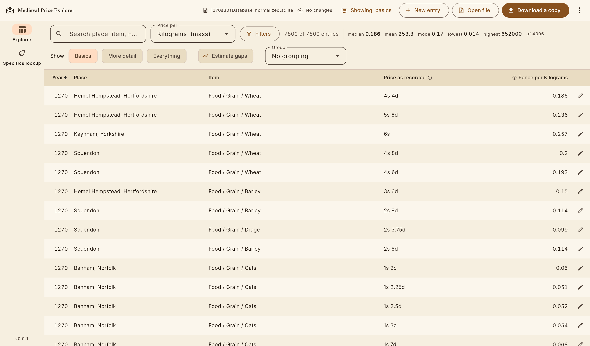
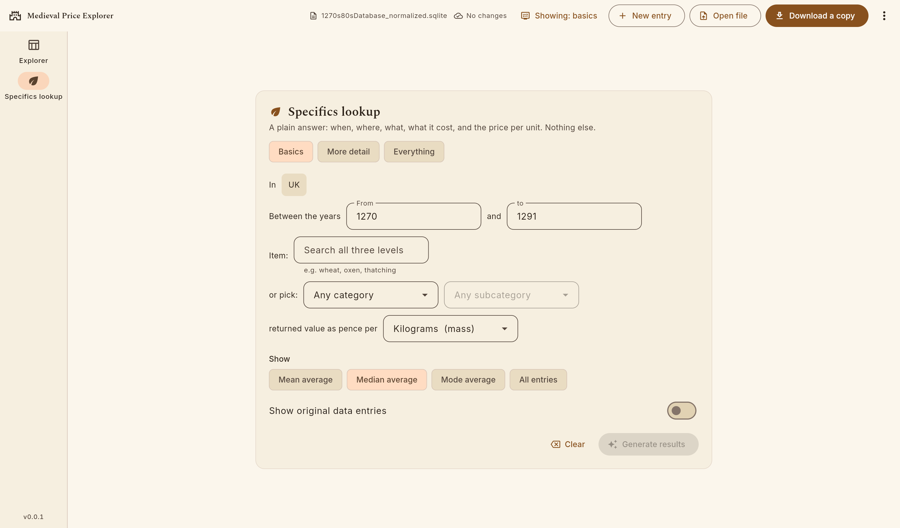

# Medieval Price Database

A normalized SQLite database of English price records from the 1270s–80s
(sourced from Thorold Rogers' *History of Agriculture and Prices in England*,
Vol. 2), plus a Flutter web app for browsing, filtering, sorting and editing
it.

7,800 price entries covering 1270–1291, across 244 localities, 66 counties and
633 specific goods and services.

The Data sheet runs to 10,379 rows, but everything from row 7801 onward is an
unfilled template row carrying only dropdown defaults — no year, place,
category, quantity or price. Those are skipped on import.

## Try it

### → [lionidas19.github.io/MedievalDatabase](https://lionidas19.github.io/MedievalDatabase/)

Nothing to install, nothing to sign in to, and nothing is uploaded anywhere.
The database is delivered with the page and everything happens in your own
browser — including any edits you make, which stay on your machine unless you
download them yourself.

There is an **Install as an app** item in the ⋮ menu (Chrome and Edge). Taking
it gives the site a desktop icon and its own window, and stores everything
locally, so it opens with no internet at all.

**The Explorer** — all 7,800 records, filtered, sorted and grouped, with the
price of each worked out in whatever unit you choose:



**Specifics lookup** — one plain answer, for when the table is more than the
question needs: what a thing cost, on average, in a place and a span of years.
It offers only what it can actually answer; a unit that cannot express the
surviving records is struck out before you pick it.



Three levels of detail — *Basics*, *More detail*, *Everything* — run through
the whole app, so the table, the cards and the entry editor all show as much
or as little as you want. See [How much to show](#how-much-to-show).

## Layout

```
Copy of 1270s80sDatabase.xlsx    the source spreadsheet the first import came from
tools/build_normalized_db.py     the original import from it, run once
tools/check_incoming_db.py       reviews an updated database before it is published
tools/migrate.py                 applies numbered schema changes to a database
tools/CALCULATIONS.md            how the spreadsheet's formulas work
tools/dump_formulas.py           recovers those formulas from the workbook
tools/dimensions.py              works out what kind of thing each unit measures
tools/currency.py                reads the Currency sheet, for prices in modern money
tools/validate_calculations.py   checks our results against the spreadsheet's
tools/build_review_db.py         builds the questions file for the researcher
app/                             the Flutter viewer/editor app
app/data/                        the database the app ships with — the source of truth
docs/                            screenshots used by this README
review/                          questions awaiting the researcher's answers
```

## What lives where

The spreadsheet is the source of truth and is never written to. The database
holds **recorded facts only** — years, places, quantities, measures, £/s/d.

Everything the spreadsheet derived by formula is deliberately *not* stored.
Total metric weight, price in pence, total sale, price per output unit: all of
it is computed at runtime by [`app/lib/services/pricing.dart`](app/lib/services/pricing.dart).

That is not tidiness for its own sake. The headline figure is "pence per X",
and X is chosen by the reader — kilograms, Tower pounds, bushels. A figure
whose unit is a question the reader asks cannot be a column in a table.

## Running the app

Requires the [Flutter SDK](https://docs.flutter.dev/get-started/install) and
any modern browser.

```bash
cd app
flutter pub get
flutter run -d chrome
```

The database is bundled with the app and loads on startup — there is nothing
to pick and no folder to choose.

### It works with no internet

Nothing is fetched at runtime. Loaded with every Google domain blocked, the
app makes **no outside requests at all** and reaches all 7,800 entries. The
rendering engine, both typefaces and the engine's own fallback font ship with
it, and no data ever leaves the machine — which matters for a tool used on a
train, behind an institutional proxy, or in an archive with no wifi.

Flutter's defaults are otherwise: it downloads its engine and a fallback
typeface from Google at startup. `web/flutter_bootstrap.js` redirects both to
folders shipped alongside the app. Don't delete it, and keep
`--no-web-resources-cdn` on the build.

### From VS Code

1. Install the recommended extensions when prompted (Dart + Flutter), or
   install `Dart-Code.flutter` manually.
2. Open this repository's root folder in VS Code.
3. Run and Debug (`F5`) → pick **"Price Explorer (Chrome)"**.

### Saving your edits

Edits are saved automatically into private browser storage, so closing the tab
does not lose them and the next visit picks up where you left off. That storage
is private to one browser on one machine and invisible to your file manager,
so it is a safety net rather than a filing system.

**Download a copy** writes the database to your device as a new timestamped
`.sqlite` file — the only form you can keep, move or send to somebody else.
**Open file** loads one back in. Nothing is ever overwritten in place, and the
bundled default is one menu click away.

Entries can be added and deleted as well as edited.

## How much to show

The brief describes three audiences: somebody who wants a quick average, a
worldbuilder or academic who wants the specific entries and their sources, and
a researcher who has come to correct a record. They are not three kinds of
person so much as three questions, so the app has one setting — **Show:
Basics / More detail / Everything** — rather than three modes.

| | The table shows | The editor offers |
|---|---|---|
| **Basics** | year, place, item, price, price per unit | where, when, what, what it cost |
| **More detail** | adds entry number, quantity, time of year, page | adds quantities and their measures, the source and page |
| **Everything** | adds all three measures, valuation measure, output X/Y, the metric total, total sale, the kind of unit, and every note and citation the record carries | every recorded field, plus the working behind each figure |

It applies everywhere at once — the table, the cards on a narrow screen, the
editor and Quick lookup all follow it. Nothing hidden at a lower level is
discarded when you save; the editor says so on the screen.

Change it from the **Showing:** button in the toolbar, the chips above the
table, or the chips in the editor itself.

## The two views

**Explorer** is the full table: search, filter by county, category and year,
sort by any column, and edit any entry. The `d / <unit>` column is computed
live against whichever output unit is selected in **Price per**. At the wider
detail levels the table scrolls sideways rather than squeezing the columns that
were already there, and the header travels with it.

**Group** gathers the rows under headings — by year, county, category, or the
kind of unit a good was measured in. Each heading carries the median price per
the chosen unit *within that group*, and says how many entries that median came
from: `median 0.186d / Kilograms from 3951 of 4015`. The rest are entries the
source cannot price, left out rather than counted as zero.

Grouping by the kind of measure is the one worth knowing about. It puts mass,
volume, area and count in separate blocks, which is what makes it visible *why*
entries drop out of an average.

**Quick lookup** answers a question in a sentence — *in [country], between
[years], [category] was valued at how many pence per [unit]* — and reports the
median, mean or mode across matching entries. It follows the same setting:
**Basics** asks the fewest questions it can, **More detail** adds region,
locality, time of year and the full category chain, and **Everything** also
reports the spread the answer came from.

## Appearance

**Display** in the toolbar holds the detail level, light/dark/system, the row
height, and three palettes:

- **Parchment** — warm leather and ink, the default.
- **High contrast** — for projectors, poor screens and tired eyes.
- **Plain** — neutral greys, for screenshots that have to sit in a paper.

All of it is remembered in this browser between visits.

### How units are handled

The source measures goods in different *kinds* of unit: some by weight, some by
volume, some by area, and some simply by the head or the dozen. Only weights
convert honestly into kilograms.

Each unit therefore carries a dimension, worked out from the researcher's own
conversion columns. Entries measured in a kind of unit that cannot reach the
one you asked for are left out of the average and reported, rather than
converted into a number that would look real and mean nothing. Asking for Food
per kilogram excludes 85 entries on that basis and drops the mean from 366
pence to 2.

These dimensions are **provisional** until the researcher confirms them — see
`review/`.

### Dates

The accounts are Julian, so a full date in them is seven days behind modern
reckoning; the editor shows both where a date exists, which is for about one
entry in seventy. (**Display** can turn the modern equivalent off; the date is
still labelled Julian either way.) Years are shown exactly as recorded.
Medieval English years often began on 25 March, so an entry dated early in the
year may belong to the following year by modern reckoning — that has
deliberately **not** been adjusted for, because which convention the source
used is an open question.

## Putting it on the web

The whole application is static — the database is a bundled asset, SQLite runs
in the browser as WebAssembly, and nothing is ever sent anywhere — so GitHub
Pages can host all of it. `.github/workflows/pages.yml` builds and publishes on
every push to `main`.

Three things have to be true, and the workflow handles all three:

1. **`--base-href` must match the repository name.** A project page is served
   from `/MedievalDatabase/`, and without this every asset is requested from
   the domain root and the app loads to a blank screen. On a user or
   organisation page (`you.github.io` itself) it is `/` instead.
2. **Jekyll has to be turned off**, or Pages skips files beginning with an
   underscore.
3. **The build is made in CI, not committed.** `app/build/` is ignored; what
   is committed is the database the build bundles.

To switch it on, once: **Settings → Pages → Source → GitHub Actions**. The site
then appears at `https://<user>.github.io/MedievalDatabase/`.

The published site is read-only in the sense that matters: visitors get their
own copy to filter, edit and download, and no edit they make can reach anybody
else. Publishing updated data means committing a new database and pushing —
see "Publishing an updated database" below.

## Installing it as an app

The site can be installed, which gives it a desktop icon, its own window with
no browser chrome, and — the point of it — everything cached locally, so it
opens with no internet at all.

In Chrome or Edge, an install icon appears at the right of the address bar
once the page has loaded; failing that it is under the browser menu (Chrome:
*Cast, save and share → Install page as app*). On a phone it is *Add to Home
screen*.

One visit online is enough. What that visit downloads — the engine, the fonts,
the 9 MB database — is stored as it arrives, so the app can be opened offline
straight afterwards without ever having been loaded a second time. Roughly
20 MB in total.

`web/sw.js` is what makes this work, and it names its cache after the
`version:` line in `app/pubspec.yaml`. **Bump that version whenever you
publish**, including for a data-only update: it is what tells an installed
copy that what it is holding is superseded. The same number is shown in the
corner of the app, so anybody reporting a problem can say which build they are
looking at.

## Questions for the researcher

`python tools/build_review_db.py` writes `review/1270s80sDatabase_review.sqlite`
— one small file listing everything that needs a human decision, openable in
any SQLite browser. It holds the unit dimensions to confirm, the time periods
to classify as months or feasts, the place coordinates a map would need, and
the conversion factors that would let prices be shown in modern money.
Columns named `your_*` are blank, for answers to be typed straight in.

### Prices in modern money

The brief asks for three figures in 2026 pounds, all keyed off the workbook's
Currency tab. **That tab is empty** — it contains no cells at all — so none of
the three can be computed yet.

The database and the importer are ready for them: fill in `currency_worksheet`
(what one penny of each year was worth, and by which index) and
`currency_rebasing_worksheet` (the single figure carrying that to the present)
in the review file, or lay the Currency sheet out as
`Year | Pounds per penny | Basis | Source | Note`, with `Base year`,
`Target year` and `Inflation multiplier` labelled anywhere on it, and rebuild.

The factors are not guessed for a reason: converting a medieval penny by
retail prices, by earnings or by share of GDP gives answers an order of
magnitude apart, and choosing between them is the researcher's call.

## Publishing an updated database

`app/data/1270s80sDatabase_normalized.sqlite` is the source of truth. The app
and the database it needs are deployed together, so publishing new records —
or a new field — is one push.

```bash
# 1. see what changed in the file you were sent. Git cannot: it is a binary
#    blob, so `git diff` will only tell you that nine megabytes moved.
python tools/check_incoming_db.py ~/Downloads/1270s80sDatabase-2026-09-07.sqlite

# 2. if the schema moved while they were working, bring their file up to it
python tools/migrate.py ~/Downloads/1270s80sDatabase-2026-09-07.sqlite

# 3. publish
cp ~/Downloads/1270s80sDatabase-2026-09-07.sqlite    app/data/1270s80sDatabase_normalized.sqlite
cd app && flutter test && cd ..
git commit -am "data: <what changed>" && git push
```

The check refuses a file that will not open, one whose references no longer
resolve, or one where `excel_cached_calculations` has been altered — that
table is the frozen record of what the spreadsheet computed, and the only
independent check on the calculation code. Everything else it reports rather
than judges: correcting a misread price is what the editor is for.

Schema changes belong in `tools/migrate.py` as numbered steps rather than
being made by hand in a database editor. A hand edit is stuck in one
particular copy, so the next file that arrives undoes it; a step applies to
whichever copy arrives, which is what lets the researcher keep working while
the schema changes.

## The original import from the spreadsheet

```bash
pip install openpyxl
python tools/build_normalized_db.py
```

This is how the 7,800 entries first got here: it normalizes the spreadsheet's
flat sheets into dimension and junction tables with UUID keys, and prints a
report of anything in the source that could not be resolved.

It is **not** a routine command any more. It rebuilds from scratch, and
anything logged in the app since has no representation in the spreadsheet to
be rebuilt from — so it refuses to run when the database holds entries the
workbook cannot account for. `--force` is there for deliberately starting
over, after moving the current database somewhere safe.

Note that measures and standards are **two separate vocabularies**: MEASURE 1/2/3
and the valuation measure resolve against the Measures sheet, while output X and
output Y resolve against Standards. They share only 3 names out of 586, and 69
of the 97 Standards entries appear nowhere in Measures. See
[tools/CALCULATIONS.md](tools/CALCULATIONS.md) for why this matters.

## Tests

```bash
cd app
flutter test
```

Runs on the Dart VM — no browser, no WASM. Alongside the unit tests and the
table's layout tests,
`calculation_corpus_test.dart` replays all 7,800 entries through the
calculator and compares every derived value against what the spreadsheet
computed for the same entry. 7,799 agree on all six; the one exception is
entry 7292 and it is listed explicitly so that it cannot rot into a silent
regression.

To re-check against the database directly and regenerate that corpus:

```bash
python tools/validate_calculations.py
```
